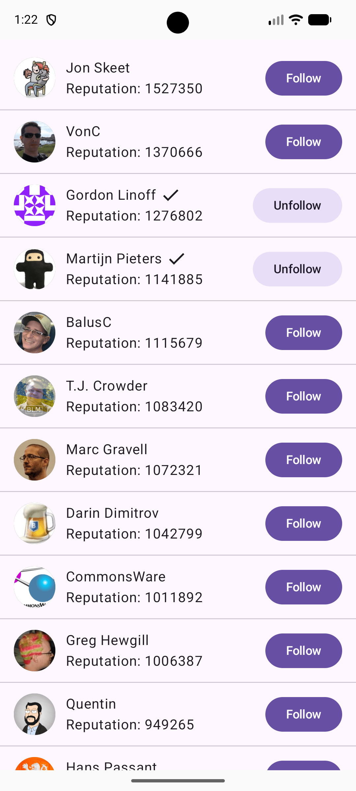

# StackOverflowUsers
An Android application that fetches a list of StackOverflow users and displays it in a list on the screen.



## Objective
Demonstrate the usage of Android app coding elements:
- MVVM architecture (using Coroutines and Flow)
- dependency injection with Hilt
- image download with Coil
- usage of sealed interface for UI State
- Ui built with Composables
- remote api access with Retrofit
- local storage with DataStore
- tests with Junit, Mockito and paparazzi

## Running the app
Open on Android Studio, wait for sync and run it. Currently, requires sdk 36.

## Testing the app
The project has some unit tests on FollowRepository and UserListViewModel.

It also has some screenshoot tests using Paparazzi:
```
./gradlew :app:recordPaparazziDebug ← use this to regenerate expected PNGs and commit them
./gradlew verifyPaparazziDebug ← compare against expected PNGs
```
Lastly, it has some Ui tests on UserListContent
